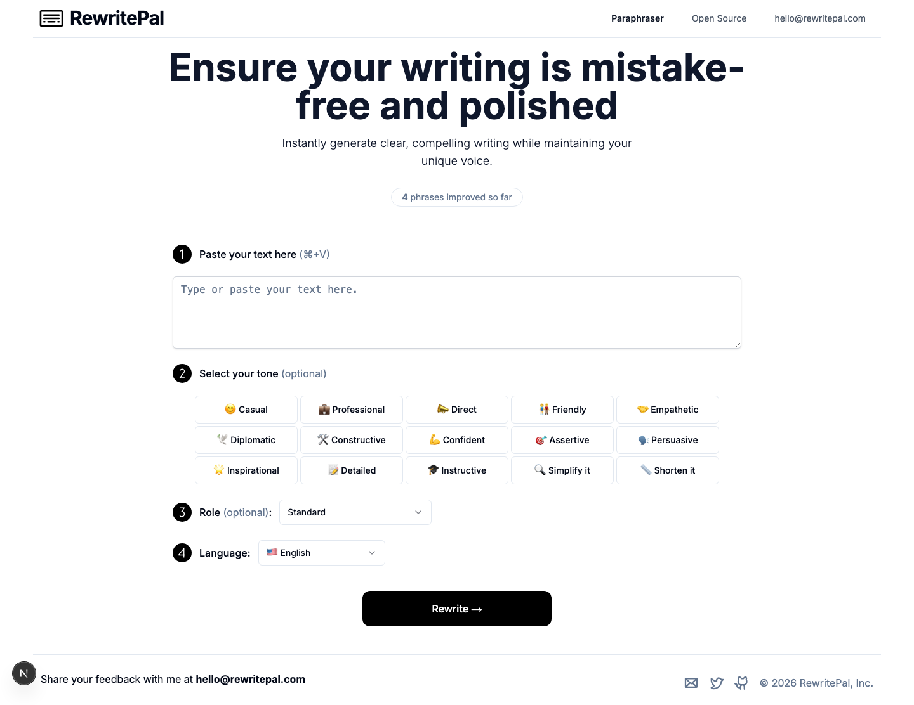

# RewritePal

[](https://github.com/kpedrok/rewrite-pal/actions/workflows/ci.yml)


RewritePal is a focused AI writing assistant that rewrites supplied text while
preserving its intent and applying optional tone, role, and language choices.
It is built as a small, production-oriented Next.js App Router project.



## Stack

- Next.js 16, React 19, TypeScript, and React Compiler
- Tailwind CSS 4 with shadcn/Radix UI primitives
- Vercel AI SDK with OpenAI
- Upstash Redis for rate limiting and the public rewrite counter
- Biome, Bun Test, Playwright, and Bun

## Local development

Prerequisites: Bun 1.3.14+ and Node.js 22+.

```bash
cp .env.example .env.local
bun install
bun dev
```

Set these variables in `.env.local` (never commit this file):

```bash
OPENAI_API_KEY=
UPSTASH_REDIS_REST_URL=
UPSTASH_REDIS_REST_TOKEN=
```

## Quality checks

```bash
bun run check       # lint, formatting, and safe static checks
bun run typecheck   # TypeScript without emitting files
bun run test        # unit and route contracts, including rate limits and counters
bun run test:e2e    # mocked browser journey through the rewrite flow
bun run build       # production build
```

GitHub Actions runs the same install, static checks, type check, and production
build on pull requests and pushes to `main`, including the Playwright journey.

## Architecture decisions

- The homepage is a Server Component; only `components/rewrite/rewrite-form.tsx`
  is client-side. This keeps the interactive boundary explicit and small.
- A shared Zod contract validates every rewrite request before prompt creation.
  Prompt construction is a pure function with focused unit tests.
- Form choices use local React state because they belong to one screen. This
  avoids global-state machinery for temporary UI state.
- The view counter remains visible as a simple client/server metric, but its
  state is local to the rewrite feature rather than globally persisted. Only a
  completed rewrite schedules its server-side increment; the browser can only
  read the displayed count.
- Redis and environment configuration are lazy server-only modules; routes fail
  safely when required deployment variables are absent.
- Playwright mocks provider and counter endpoints, so the core browser journey
  is deterministic and does not spend API credits in CI.

## Project structure

```text
app/                 routes, metadata, and API route handlers
components/rewrite/  interactive rewrite feature
components/ui/       reusable UI primitives
e2e/                 one realistic mocked browser journey
lib/rewrite/         request contract and prompt construction
public/              static logos and icons
```

## Security and privacy

The rewrite endpoint is rate limited through Upstash using Vercel’s trusted
proxy header. Submitted text is sent to the configured AI provider to generate
a rewrite. Avoid entering sensitive information unless the provider and
deployment privacy policies meet your requirements.

## Contributing

Keep changes small and accessible, run the quality checks above, and describe
any environment-variable or user-facing behavior changes in the pull request.
